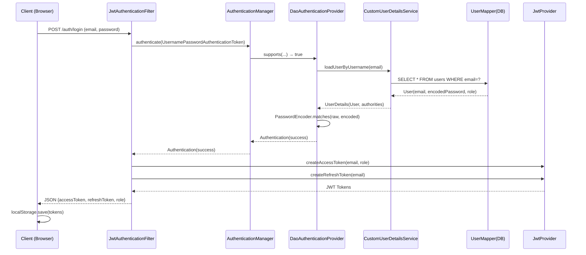

```mermaid
sequenceDiagram
participant C as Client (Browser)
participant F as JwtAuthenticationFilter
participant M as AuthenticationManager
participant P as DaoAuthenticationProvider
participant S as CustomUserDetailsService
participant DB as UserMapper(DB)
participant J as JwtProvider

    C->>F: POST /auth/login (email, password)
    F->>M: authenticate(UsernamePasswordAuthenticationToken)
    M->>P: supports(...) → true
    P->>S: loadUserByUsername(email)
    S->>DB: SELECT * FROM users WHERE email=?
    DB-->>S: User(email, encodedPassword, role)
    S-->>P: UserDetails(User, authorities)
    P->>P: PasswordEncoder.matches(raw, encoded)
    P-->>M: Authentication(success)
    M-->>F: Authentication(success)
    F->>J: createAccessToken(email, role)
    F->>J: createRefreshToken(email)
    J-->>F: JWT Tokens
    F-->>C: JSON {accessToken, refreshToken, role}
    C->>C: localStorage.save(tokens)
```